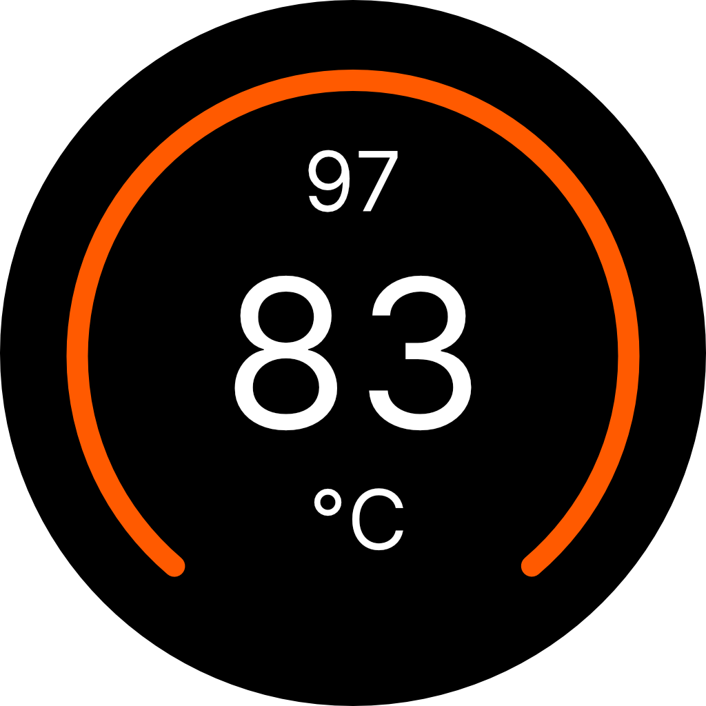

# StaggAssistant 🦢☕️

A Home Assistant integration for the **Fellow Stagg EKG Pro** kettle.

> **This is an expanded fork** of [fabiankirchen/staggassistant](https://github.com/fabiankirchen/staggassistant). Huge thanks to [Fabian Kirchen](https://github.com/fabiankirchen) for the original integration! This fork adds support for sensors, switches, number controls, select dropdowns, and action buttons — going beyond the built-in climate entity to expose more of the kettle's capabilities.

This integration bypasses the need for an official API by communicating directly with the kettle's internal **CLI wrapper** over HTTP.

 

## ✨ Features

* **Climate Entity:** Full climate platform with heat/off modes, target temperature with 0.5°C precision, and current temperature display.
* **Sensors:** Monitor current/target temperature, state mode (Off, Heat, Hold), clock time, schedule time, and schedule temperature.
* **Number Controls:** Adjust hold time duration (0-60 min), altitude setting (0-3000 m), and chime volume (0-10) with sliders.
* **Select Dropdowns:** Choose clock style (off/digital/analog), language (en/fr/es), temperature units (C/F), and schedule mode (off/once/repeat).
* **Action Buttons:** Simulate physical button presses (main/back), rotate the dial left/right, sync time from Home Assistant, and force data refresh.
* **Direct CLI Communication:** Sends commands directly to the device's internal interface.
* **Configurable:** Adjust the update interval to your liking (default: 15s).

## 📋 Entities Provided

| Platform | Entity | Description |
|---|---|---|
| **climate** | Climate | Heat/Off control, target temperature (0.5°C steps), current temp |
| **sensor** | Current Temperature | Current water temperature |
| **sensor** | Target Temperature | Target set temperature |
| **sensor** | State Mode | Kettle state (Off, Heat, Hold, etc.) |
| **sensor** | Clock Time | Current kettle clock time |
| **sensor** | Schedule Time | Scheduled time (HH:MM) |
| **sensor** | Schedule Temperature | Scheduled target temperature |
| **switch** | Pre-Boil | Toggle pre-boil feature on/off |
| **number** | Hold Time Duration | Set hold time in minutes (0-60) |
| **number** | Altitude Setting | Set altitude for boil calibration (0-3000 m) |
| **number** | Chime Volume | Set chime volume (0-10) |
| **select** | Clock Style | Choose off, digital, or analog clock display |
| **select** | Language Selection | Choose English, French, or Spanish |
| **select** | Temperature Units | Switch between Celsius and Fahrenheit |
| **select** | Schedule Mode | Choose off, once, or repeat schedule |
| **button** | Press Main Button | Simulate pressing the main dial button |
| **button** | Press Back Button | Simulate pressing the back button |
| **button** | Rotate Dial Left | Rotate the dial counter-clockwise |
| **button** | Rotate Dial Right | Rotate the dial clockwise |
| **button** | Sync Time | Sync Home Assistant time to the kettle |
| **button** | Reload Data | Force refresh of kettle data |

## 🚀 Installation

### Option 1: HACS (Recommended)

1.  Open HACS in Home Assistant.
2.  Go to **Integrations** > Top right menu (**⋮**) > **Custom repositories**.
3.  Add the URL of this repository: `https://github.com/miguelcaravantes/staggassistant`
4.  Category: **Integration**.
5.  Click **Add**, then search for "StaggAssistant" in the list and install it.
6.  Restart Home Assistant.

### Option 2: Manual

1.  Download the latest release from the [Releases section](https://github.com/miguelcaravantes/staggassistant/releases).
2.  Unzip the file.
3.  Copy the `custom_components/staggassistant` folder into your `custom_components` directory (`/config/custom_components/staggassistant`).
4.  Restart Home Assistant.

## ⚙️ Configuration

1.  Go to **Settings** > **Devices & Services**.
2.  Click **Add Integration** in the bottom right corner.
3.  Search for **StaggAssistant**.
4.  Enter the **IP address** of your kettle.

## 🔀 Differences from Original

This fork extends the original [StaggAssistant by Fabian Kirchen](https://github.com/fabiankirchen/staggassistant) with the following additions beyond the core climate control:

* Added **sensor** platform for temperature, mode, clock, and schedule monitoring
* Added **number** platform for hold time, altitude, and chime volume controls
* Added **select** platform for clock style, language, temperature units, and schedule mode
* Added **switch** platform for pre-boil toggling
* Added **button** platform for physical button/dial simulation, time sync, and data reload
* Coordinator now fetches both `state` and `prtsettings` endpoints (plus `prtclock`)
* Human-readable state mode names, schedule temperature parsing, and automatic entity cleanup

## ❤️ Credits

* **Original integration** by [Fabian Kirchen](https://github.com/fabiankirchen) — [fabiankirchen/staggassistant](https://github.com/fabiankirchen/staggassistant)
* Big thanks to the repos **[stagg-ekg-pro](https://github.com/tomtastic/stagg-ekg-pro)** & **[homebridge-kettle](https://github.com/Willmac16/homebridge-kettle/tree/ekg-pro-cli)** through which the CLI communication method was discovered.

## 📄 License

MIT License. See [LICENSE](LICENSE) file for more details.
This project is not affiliated with Fellow Industries, Inc.
